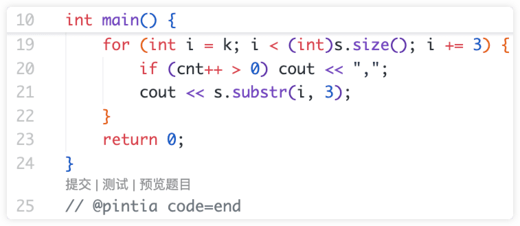
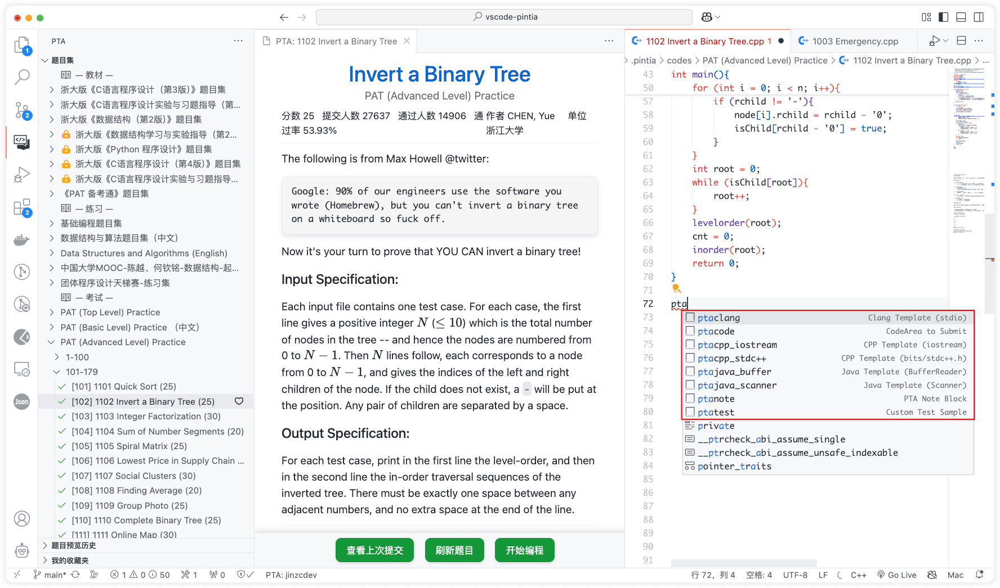

# 拼题A (Pintia) for VS Code

> 在 VS Code 中练习拼题 A 编程类习题

  

  
  

- [English Document](./docs/README_en-US.md) | 中文文档

‼️ 国内可访问 [Gitee 镜像仓库](https://gitee.com/jinzcdev/vscode-pintia). ‼️

⬇️ 安装 Pintia: [Visual Studio Marketplace](https://marketplace.visualstudio.com/items?itemName=jinzcdev.vscode-pintia), [VS Code (推荐)](https://code.visualstudio.com/) or [Install from VSIX](https://github.com/jinzcdev/vscode-pintia/releases/latest)

## 0. 运行条件

- [VS Code 1.66.0+](https://code.visualstudio.com/)

## 1. 功能

### 1.1 登录/登出

  

- 只需在 `Pintia Explorer` 中点击 `登录拼题A/Sign in PTA` ，即可登录拼题A。(目前，支持 **微信二维码**、**Cookie** 登录）。
- 你也可以使用以下命令来登录/退出。
    - **PTA: Sign In**
    - **PTA: Sign Out**

---

### 1.2 预览题目

  

- 点击问题，即可查看问题描述

    > ⭐️ **注意：**
    >
    > - 你可以通过修改配置项 `pintia.workspaceFolder` 来指定存储题目文件的工作区路径。默认值为 **\$HOME/.pintia/codes**
    > - 你可以通过 `PTA: Change Default Language` 命令来更换默认语言

---

### 1.3 编辑器快捷键

  

- 该插件支持 3 个编辑器快捷键

    - `提交/Submit`：向拼题 A 提交你的答案
    - `测试/Test`：用 **自定义的测试样例** 或 **默认样例** 测试你的答案
    - `预览题目/Preview`: 在源文件中打开习题预览

---

### 1.4 自定义测试样例

  

- 你可以把你的代码放在 `@pintia code=start` 和 `@pintia code=end` 之间（在编辑区中输入 `ptacode` 来快速添加）
- 另外，你可以把你的 **自定义测试样例** 放在 `@pintia test=start` 和 `@pintia test=end` 之间（输入 `ptatest` 可以快速添加），并点击 `Test custom sample {i}` 以快速测试你的代码。

> ⭐️ **Note:** 在点击 `submit` 或 `test` 提交你的代码时，只有在包裹在 `@pintia code=start` 和 `@pintia code=end` 之间的代码会被提交给拼题 A 判题器。

---

### 1.5 搜索题目

点击 Pintia 视图顶部的 `搜索` 图标，或者打开 命令面板，使用 `PTA: Search Problem` 快捷命令。

  

---

### 1.6 笔记功能

你可以在代码编辑区键入 `ptanote` 生成笔记块，在其中输入你的笔记，下次预览题目时，笔记会以 Markdown 的形式解析并预览。

  

> ⭐️ **Note:** 笔记是随着代码一起提交到 拼题 A 的，并不存在本地。提交代码后，重新点击编辑器的 `Preview`，或者下次预览本题时，会显示你的笔记。

---

### 1.7 题目收藏

你可以在题目集中点击右侧的按钮收藏题目。该功能不依赖于官方的服务，因此只能将收藏的题目存储在本地。后续会考虑使用其他方式实现数据的同步。

---

### 1.8 代码片段

你可以在代码编辑器中输入以下前缀来快速生成相应的代码块，如下所示。

| 前缀            | 说明                                                                                             |
| --------------- | ------------------------------------------------------------------------------------------------ |
| ptacode         | 把你的自定义测试样例放在 `@pintia code=start/end` 中，当你点击 `Submit` 按钮时，插件会自动识别它 |
| ptatest         | 将你的自定义测试样例放在 `@pintia test=start/end` 中，当你点击 `Test` 按钮时，插件会自动识别它   |
| ptacpp_stdc++   | 获取头文件为 `bits/stdc++.h` 的 cpp 模板                                                         |
| ptacpp_iostream | 获取带有 `iostream` 头文件的 cpp 模板                                                            |
| ptaclang        | 获取带有头文件 `stdio.h` 的 clang 模板                                                           |
| ptajava_buffer  | 获取带有 `BufferReader` 的 java 模板                                                             |
| ptajava_scanner | 获取带有 `Scanner` 的 java 模板                                                                  |
| ptanote         | 生成 `@pintia note=start/end` 笔记块                                                             |

---

## 2. 插件命令

使用 `Ctrl+Shift+P` (in Windows) 或 `Command+Shift+P` (in Mac) 打开命令面板并输入 `pta` 可快速使用插件的相关命令。

| 命令                               | 描述                | 备注                                                             |
| ---------------------------------- | ------------------- | ---------------------------------------------------------------- |
| `pintia.clearCache`                | 清除题目缓存        | 发现题目集信息与官方不同时可使用该命令                           |
| `pintia.signIn`                    | 登录                |                                                                  |
| `pintia.signOut`                   | 退出登录            |                                                                  |
| `pintia.changeDefaultLanguage`     | 修改默认编程语言    | 可设置拼题 A 官方所支持的所有语言                                |
| `pintia.changeWorkspaceFolder`     | 修改工作区文件夹    |                                                                  |
| `pintia.checkIn`                   | 签到拼题 A 教育商店 | 建议在配置项中设置成自动签到                                     |
| `pintia.reportIssue`               | 问题反馈            |                                                                  |
| `pintia.searchProblem`             | 搜索题目            | 默认忽略 ZOJ 题目集，可在配置项中修改                            |
| `pintia.refreshProblemSearchIndex` | 刷新题目搜索索引    | 为了加快数据加载速度，数据被缓存在本地，如果发现数题目缺失可刷新 |
| `pintia.openWorkspace`             | 打开 Pintia 工作区  |                                                                  |
| `pintia.clearViewedProblems`       | 清除题目预览历史    |                                                                  |
| `pintia.clearFavoriteProblems`     | 清除我的收藏夹      |                                                                  |

## 3. 插件配置项

| 设置名称                                     | 描述                                                                                                                       | 默认值                          |
| -------------------------------------------- | -------------------------------------------------------------------------------------------------------------------------- | ------------------------------- |
| `pintia.workspaceFolder`                     | 工作区文件夹的路径（存储题目源文件）。                                                                                     | `""`                            |
| `pintia.previewProblem.openAndCodeIt`        | 指定是否在预览题目时自动打开代码编辑器，开启时建议不要将 `#pintia.previewProblem.defaultOpenedMethod#` 设置为 `总是询问`。 | `false`                         |
| `pintia.previewProblem.defaultOpenedMethod`  | 指定打开代码编辑器的方式，默认为 `总是询问`。                                                                              | `总是询问`                      |
| `pintia.paging.pageSize`                     | 指定当题目集较大时候，是否对题目列表分页。pageSize 为 0 表示不分页。                                                       | `100`                           |
| `pintia.codeColorTheme`                      | 指定代码着色主题。                                                                                                         | `atom-one`                      |
| `pintia.showLocked`                          | 指定是否显示未解锁的题集（一些教材题目集）。                                                                               | `true`                          |
| `pintia.enableStatusBar`                     | 指定是否显示 PTA 状态栏。                                                                                                  | `true`                          |
| `pintia.autoCheckIn`                         | 指定是否在激活插件时自动签到 PTA 教育商店。                                                                                | `true`                          |
| `pintia.defaultLanguage`                     | 设置答题时默认使用的编程语言。                                                                                             | `C++ (g++)`                     |
| `pintia.editor.shortcuts`                    | 自定义编码时的编辑器快捷键。                                                                                               | `["Submit"，"Test", "Preview"]` |
| `pintia.searchIndex.ignoreZOJ`               | 指定搜索题目时，是否忽略 **_ZOJ Problem Set_** 题集。                                                                      | `true`                          |
| `pintia.searchIndex.ignoreLockedProblemSets` | 指定搜索题目时，是否忽略 **_未被解锁的_** 题集。                                                                           | `true`                          |
| `pintia.searchIndex.autoRefresh`             | 指定是否在激活插件时自动刷新题目搜索索引（不推荐设置，因为固定题集更新频率较低且获取索引较耗时）。                         | `false`                         |
| `pintia.autoCreateProblemSetFolder`          | 指定创建题目源文件时是否自动创建其习题集文件夹并将源代码文件放入相应的文件夹中。                                           | `true`                          |
| `pintia.problemHistoryListSize`              | 指定题目预览历史列表的大小。                                                                                               | `200`                           |

## 4. 需要帮助？

在遇到任何问题时，你可以先查看 [故障排除](https://github.com/jinzcdev/vscode-pintia/wiki/Troubleshooting) 和 [常见问题](https://github.com/jinzcdev/vscode-pintia/wiki/FAQ)。

如果问题仍然无法解决，可随时 [创建一个新的 Issue](https://github.com/jinzcdev/vscode-pintia/issues/new/choose)。

## 5. 更新日志

请参考 [CHANGELOG](https://github.com/jinzcdev/vscode-pintia/blob/main/CHANGELOG.md) | [英文文档](https://github.com/jinzcdev/vscode-pintia/blob/main/docs/CHANGELOG_en-US.md)

## 6. 鸣谢

- Pintia (拼题A) 插件的功能设计参考了 [LeetCode](https://marketplace.visualstudio.com/items?itemName=LeetCode.vscode-leetcode)。
