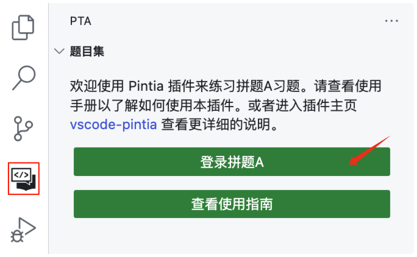
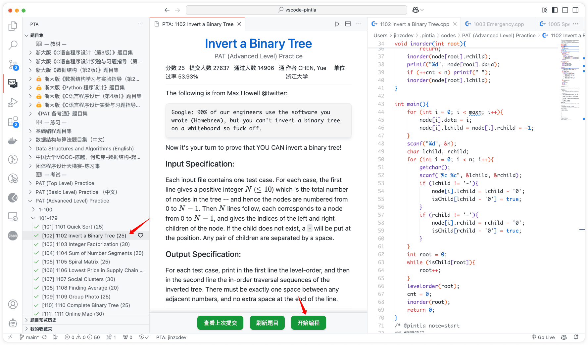

# Pintia

> Solve PTA problems in VS Code

  

  
  

- English Document | [中文文档](../README.md)

‼️ If you are in China, you can visit [Gitee](https://gitee.com/jinzcdev/vscode-pintia). ‼️

⬇️ Install Pintia from [Visual Studio Marketplace](https://marketplace.visualstudio.com/items?itemName=jinzcdev.vscode-pintia), [VS Code (recommended)](https://code.visualstudio.com/) or [Install from VSIX](https://github.com/jinzcdev/vscode-pintia/releases/latest).

## 0. Requirements

- [VS Code 1.66.0+](https://code.visualstudio.com/)

## 1. Features

### 1.1 Sign In/Out

  

- Simply click `Sign in PTA` in the `Pintia Explorer` will let you **sign in** with your Pintia account. (Currently, only **WeChat QR** codes are supported for signin)
- You can also use the following command to sign in/out:
  - **Pintia: Sign in**
  - **Pintia: Sign out**

---

### 1.2 Preview a Problem

  

- Directly click on the problem to see the problem description.

  > :star: **Note:** 
  > - You can specify the path of the workspace folder to store the problem files by updating the setting `pintia.workspaceFolder`. The default value is：**\$HOME/.pintia/codes**.
  > - You can change the default language by triggering the command: `Pintia: Change Default Language`.

---

### 1.3 Editor Shortcuts

  

- The extension supports 3 editor shortcuts (aka Code Lens):

  - `Submit`: Submit your answer to Pintia.
  - `Test`: Test your answer with customized test cases or default ones.
  - `Preview`: Open the problem preview in source files.

---

### 1.4 Custom Test Samples

  

- You can put your codes between `@pintia code=start` and `@pintia code=end` (enter `ptacode` to quickly add them).
- Also, you can put your custom test samples between `@pintia test=start` and `@pintia test=end` (enter `ptatest` to quickly add them).
And then click `Test custom sample` to quickly test your code.
> :star: **Note:** Only the code wrapped between `@pintia code=start` and `@pintia code=end` will be submitted to Pintia judge when you try to submit your codes by clicking `submit` or `test`.

---

### 1.5 Search for Problems

Click the `Search` icon at the top of the `Pintia` view or open the `Command Palette` to use shortcut command `Pintia: Search Problem`.

  

---

### 1.6 Notebook

you can type `ptanote` in the code editor to generate a **note block**, where you can enter your notes, and the next time you preview the problem, the notes will be parsed and previewed in Markdown.

  

> :star: **Note:** Your notes are submitted to PTA along with the code, not stored locally. After submitting the code, re-click `Preview` in the editor, or the next time you preview problems, your notes will be displayed on the preview page of the problem.

---

### 1.7 Collect Problems

You can add the problem to the `My Favorites` list by clicking the button on the right side of the problem. This feature does not depend on the official service, so you can only store the collected topics locally. The synchronization of data will be considered later using other methods.

---

### 1.8 Snippets

You can enter the following prefixes in code editor to generate the corresponding code blocks quickly, as follows:

| Prefix          | Description                                                                                                                                    |
| --------------- | ---------------------------------------------------------------------------------------------------------------------------------------------- |
| ptacode         | Put your custom test samples in `@pintia code=start/end` and the extension will automatically recognize it when you click the `Submit` button. |
| ptatest         | Put your custom test samples in `@pintia test=start/end` and the extension will automatically recognize it when you click the `Test` button.   |
| ptacpp_stdc++   | Get the template of cpp with header file of `bits/stdc++.h`                                                                                    |
| ptacpp_iostream | Get the template of cpp with header file of `iostream`                                                                                         |
| ptaclang        | Get the template of clang with header file of `stdio.h`                                                                                        |
| ptajava_buffer  | Get the template of java with `BufferReader`                                                                                                   |
| ptajava_scanner | Get the template of java with `Scanner`                                                                                                        |
| ptanote         | Generate `@pintia note=start/end` block                                                                                                        |

---

## 2. Commands

Use `Ctrl+Shift+P` (in Windows) or `Command+Shift+P` (in Mac) to open the command panel and enter `pintia` for quick access to the `Pintia Extension`'s related commands.

| Command                            | Description                   | Note                                                                                             |
| ---------------------------------- | ----------------------------- | ------------------------------------------------------------------------------------------------ |
| `pintia.clearCache`                | Clear Cache                   | Use this command if the problem set information is different from the official one.              |
| `pintia.signIn`                    | Sign In                       |                                                                                                  |
| `pintia.signOut`                   | Sign Out                      |                                                                                                  |
| `pintia.changeDefaultLanguage`     | Change Default Language       | Set any language supported by Pintia.                                                            |
| `pintia.changeWorkspaceFolder`     | Change Workspace Folder       |                                                                                                  |
| `pintia.checkIn`                   | Check In PTA                  | It is recommended to set it to auto check-in in the settings.                                    |
| `pintia.reportIssue`               | Report Issue                  |                                                                                                  |
| `pintia.searchProblem`             | Search Problem                | By default, ZOJ problem sets are ignored, which can be modified in the settings.                 |
| `pintia.refreshProblemSearchIndex` | Refresh Problem Search Index  | To speed up data loading, data is cached locally. If you find missing problems, you can refresh. |
| `pintia.openWorkspace`             | Open Pintia Workspace         |                                                                                                  |
| `pintia.clearViewedProblems`       | Clear Problem Preview History |                                                                                                  |
| `pintia.clearFavoriteProblems`     | Clear My Favorites            |                                                                                                  |

## 3. Settings

| Setting Name                                 | Description                                                                                                                                                                                        | Default Value                   |
| -------------------------------------------- | -------------------------------------------------------------------------------------------------------------------------------------------------------------------------------------------------- | ------------------------------- |
| `pintia.workspaceFolder`                     | Specify the path of the workspace folder to store the problem files.                                                                                                                               | `""`                            |
| `pintia.previewProblem.openAndCodeIt`        | Specify whether to automatically open the code editor when previewing a problem. It is recommended not to set `#pintia.previewProblem.defaultOpenedMethod#` to `Always Ask` when enabled.          | `false`                         |
| `pintia.previewProblem.defaultOpenedMethod`  | Specify the method of opening the code editor when previewing a problem and the default is `Always Ask`.                                                                                           | `Always Ask`                    |
| `pintia.paging.pageSize`                     | Specify whether to page the problem list when the problem set is too large. It is not paged when pageSize is 0.                                                                                    | `100`                           |
| `pintia.codeColorTheme`                      | Specify the code color theme.                                                                                                                                                                      | `atom-one`                      |
| `pintia.showLocked`                          | Show locked problems.                                                                                                                                                                              | `true`                          |
| `pintia.enableStatusBar`                     | Specify whether the Pintia status bar is displayed.                                                                                                                                                | `true`                          |
| `pintia.autoCheckIn`                         | Specify whether to automatically check in Pintia's education supermarket when the Pintia Extension is activated.                                                                                   | `true`                          |
| `pintia.defaultLanguage`                     | Default language for solving the problems.                                                                                                                                                         | `C++ (g++)`                     |
| `pintia.editor.shortcuts`                    | Customize the shortcuts in editors.                                                                                                                                                                | `["Submit", "Test", "Preview"]` |
| `pintia.searchIndex.ignoreZOJ`               | Specify whether to ignore the problem set, ***ZOJ Problem Set***, in the problem search index.                                                                                                     | `true`                          |
| `pintia.searchIndex.ignoreLockedProblemSets` | Specify whether to ignore locked problem sets in the problem search index.                                                                                                                         | `true`                          |
| `pintia.searchIndex.autoRefresh`             | Specify whether to automatically refresh exercise problem search index when the Pintia Extension is activated. It is not recommended to set it due to the low-frequency update and time-consuming. | `false`                         |
| `pintia.autoCreateProblemSetFolder`          | Specify whether to automatically create a problem set folder and place source code files in this directory when coding a problem.                                                                  | `true`                          |
| `pintia.problemHistoryListSize`              | Specify the size of the problem preview history list.                                                                                                                                              | `200`                           |

## 4. Want Help?

When you meet any problem, you can check out the [Troubleshooting](https://github.com/jinzcdev/vscode-pintia/wiki/Troubleshooting) and [FAQ](https://github.com/jinzcdev/vscode-pintia/wiki/FAQ) first.

If your problem still cannot be addressed, feel free to [file an issue](https://github.com/jinzcdev/vscode-pintia/issues/new/choose).

## 5. Release Notes

Refer to [CHANGELOG](https://github.com/jinzcdev/vscode-pintia/blob/main/CHANGELOG.md) | [中文文档](https://github.com/jinzcdev/vscode-pintia/blob/main/docs/CHANGELOG_en-US.md)

## 6. Acknowledgement

- The design of the `Pintia Extension` references the design of the [LeetCode](https://marketplace.visualstudio.com/items?itemName=LeetCode.vscode-leetcode) in many of its features.