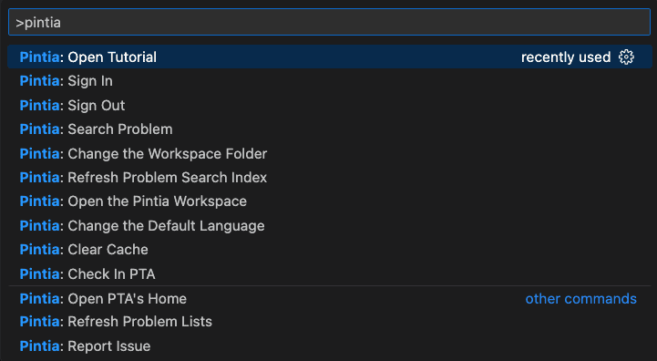

# Tips for Shortcut Commands

- `Pintia: Check In PTA`: Check in the education supermarket of PTA.
- `Pintia: Clear Cache`: If the description of the problem does not match that of the website, try to clear cache.
- `Pintia: Refresh Problem Search Index`: To speed up the search, the problem index is cached locally. If a problem is missing, use this command to refresh the index.
- `Pintia: Refresh Problem List`: Sync answer results with PTA server.

<!-- 使用Pintia Extension帮助你高效地在VS Code中完成拼题A的编程练习。如果这个插件对你有用，请为我的项目star吧。 -->