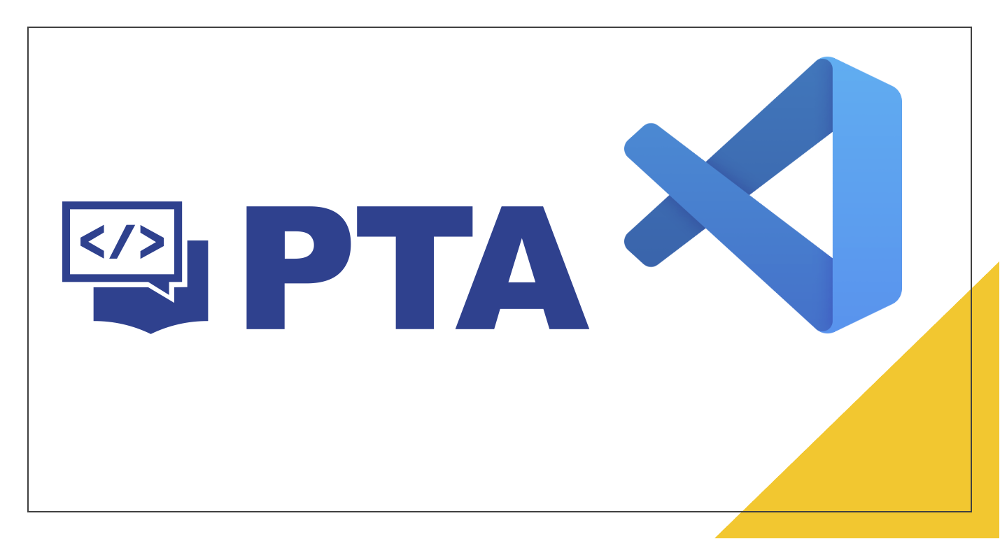

# 概述

插件功能介绍：

1. 在 VS Code 中登录 拼题A
2. 预览习题、自动创建源文件
3. 快速提交、测试你的代码
4. 在源文件中嵌入自定义测试样例并提交测试
5. 快速搜索公共题库中的习题
6. 以 Markdown 的格式记录笔记
7. 收藏题目在本地
8. 内置常用的 C++、Java 代码模板

使用 Pintia Extension 帮助你高效地在 VS Code 中完成拼题 A 的编程练习。

如果这个插件对你有用，请为我的仓库 [Star](https://github.com/jinzcdev/vscode-pintia) 吧。
