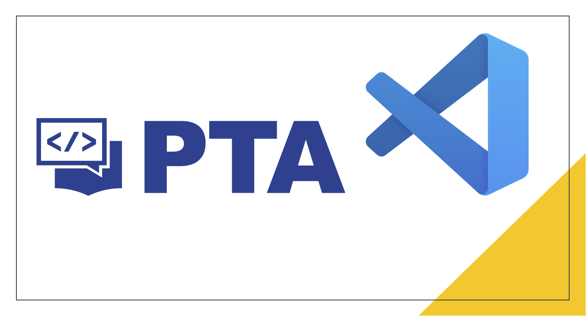

# Overview

1. Sign in Pinta (PTA) in VS Code
2. Preview problems, create source files automatically
3. Submit and test your code quickly
4. Create custom test samples in the source file and submit them quickly
5. Search for public problems quickly
6. Take Notes in Markdown
7. Add your favorite problems
8. Built-in common C++, Java code templates

Use the Pintia Extension to help you efficiently complete programming exercises in Pintia (PTA) in VS Code.

If this extension is useful to you, please star it for my [repo](https://github.com/jinzcdev/vscode-pintia).
