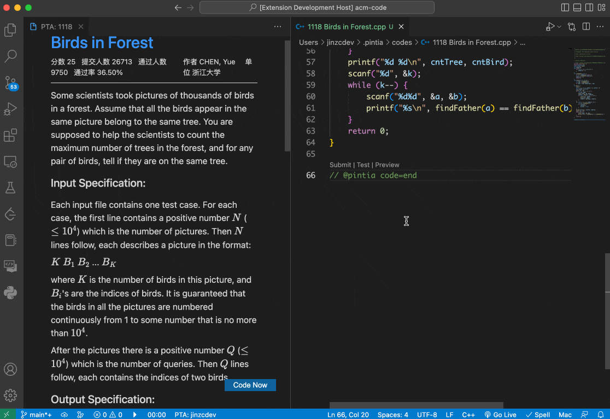

## 编码、提交与测试

在源文件中，你可以使用以下快捷键提交或测试你的代码：

| Windows/Linux 系统 | MacOS 系统    | 功能           |
| ------------------ | ------------- | -------------- |
| `Ctrl+Enter`       | `Cmd+Enter`   | 创建题目源文件 |
| `Ctrl+Shift+J`     | `Cmd+Shift+J` | 提交代码       |
| `Ctrl+Shift+K`     | `Cmd+Shift+K` | 测试代码       |

你可以在 VS Code 的设置中修改这些快捷键映射。

⚠️ 注意: 你只能在激活插件且在具有 PTA 标识模板的源文件中使用这些快捷键。
