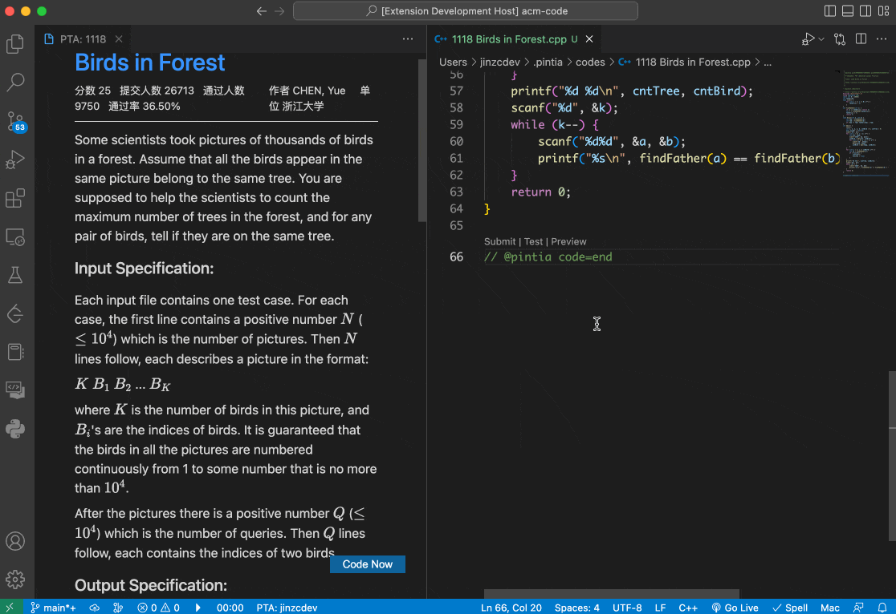

## Coding, Submitting, and Testing

In your source file, you can use these shortcuts to submit or test your code:

| Windows/Linux  | MacOS         | Function           |
| -------------- | ------------- | ------------------ |
| `Ctrl+Enter`   | `Cmd+Enter`   | Create source file |
| `Ctrl+Shift+J` | `Cmd+Shift+J` | Submit code        |
| `Ctrl+Shift+K` | `Cmd+Shift+K` | Test code          |

You can modify these shortcut mappings in VS Code settings.

⚠️ Note: You can only use these shortcuts in source files with PTA identifier templates when the extension is activated.
